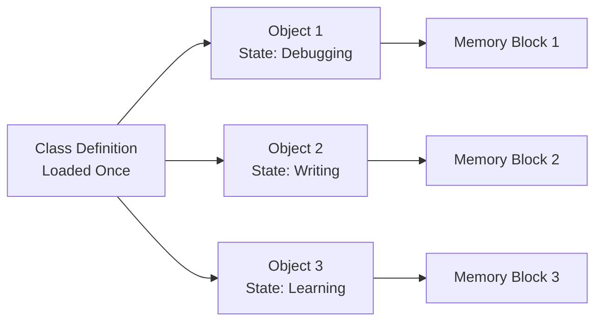

# Memory Model Diagram

## Explanation

- The **Class Definition** is loaded once into memory and serves as the template.
- Each **Object** is a separate instance with its own state and its own memory allocation.
- This illustrates why changes to one object don't affect others — they occupy independent memory blocks.
