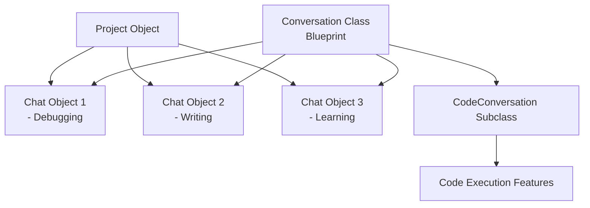

# OOP System Diagram

## Explanation

- **Conversation Class** is the blueprint that defines shared structure (topic, history, methods).
- **Chat Objects 1–3** are instances, each with unique state (Debugging, Writing, Learning).
- **Project Object** demonstrates composition — it contains references to multiple Conversation objects.
- **CodeConversation Subclass** shows inheritance — it extends Conversation with code execution capabilities.
